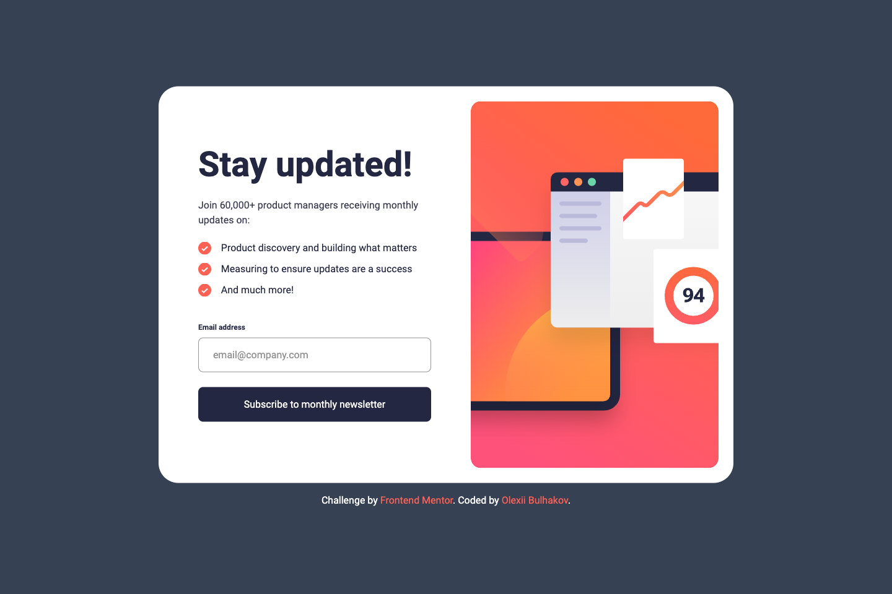

# Frontend Mentor - Newsletter sign-up form with success message solution

This is a solution to the [Newsletter sign-up form with success message challenge on Frontend Mentor](https://www.frontendmentor.io/challenges/newsletter-signup-form-with-success-message-3FC1AZbNrv). Frontend Mentor challenges help you improve your coding skills by building realistic projects.

## Table of contents

- [Overview](#overview)
  - [The challenge](#the-challenge)
  - [Screenshot](#screenshot)
  - [Links](#links)
- [My process](#my-process)
  - [Built with](#built-with)
  - [What I learned](#what-i-learned)
  - [Continued development](#continued-development)
  - [Useful resources](#useful-resources)
- [Author](#author)

## Overview

### The challenge

Users should be able to:

- Add their email and submit the form
- See a success message with their email after successfully submitting the form
- See form validation messages if:
  - The field is left empty
  - The email address is not formatted correctly
- View the optimal layout for the interface depending on their device's screen size
- See hover and focus states for all interactive elements on the page

### Screenshot



### Links

- Solution URL: [GihHub repo](https://github.com/bulhakovolexii/newsletter-sign-up-with-success-message/)
- Live Site URL: [GitHub pages](https://bulhakovolexii.github.io/newsletter-sign-up-with-success-message/)

## My process

### Built with

- Semantic HTML5 markup
- Flexbox
- Mobile-first workflow
- [Tailwind CSS](https://tailwindcss.com/)
- [Typescript](https://www.typescriptlang.org/)
- [Vite](https://vite.dev/)

### What I learned

This was my first time using Vite to automatically bundle HTML, CSS, Tailwind, and TypeScript.
I am proud of the result, as the setup process turned out to be faster and more flexible compared to traditional bundlers.

I encountered issues with relative paths not working correctly when publishing to GitHub Pages.
To fix this, I had to explicitly set the base option in the Vite config and connect Tailwind through a plugin:

``` ts
// vite.config.ts
import { defineConfig } from "vite";
import tailwindcss from "@tailwindcss/vite";

export default defineConfig({
  base: "/newsletter-sign-up-with-success-message/",
  plugins: [tailwindcss()],
});
```

Additionally, setting up GitHub Actions for automatic deployment was necessary.
I used a static.yml template and added an extra build step:

``` yaml
- name: Build
  run: npm run build
```

### Continued development

Currently, I am resetting the application state by triggering a page reload via an <a href=""> element.
I would like to find a more elegant solution using TypeScript, such as resetting the state without a full page reload.
However, my current knowledge of TS is not sufficient to implement this yet.

```html
<a href="">Dismiss message</a>
```

### Useful resources

[Tailwind CSS Installation with Vite](https://tailwindcss.com/docs/installation/using-vite) – Official guide for setting up Tailwind CSS in a Vite project, providing the most efficient and modern development workflow.  
[Vite Official Website](https://vite.dev/) – Official documentation and resources for Vite, a fast build tool and development server.

## Author

- GitHub - [@bulhakovolexii](https://github.com/bulhakovolexii)
- Frontend Mentor - [@bulhakovolexii](https://www.frontendmentor.io/profile/bulhakovolexii)
- LinkedIn - [@bulhakovolexii](https://www.linkedin.com/in/bulhakovolexii/)
